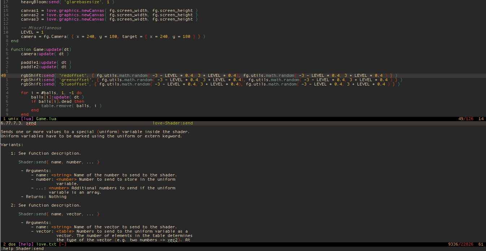

Vim LOVE Docs
===

Vim syntax highlighting and helpfile for [LÖVE](http://love2d.org).

Usage
---

__Instalation:__

- Pathogen: Put in `vimfiles/bundles`
- Vundle: Clone the repo and run the follow the instructions below to generate the documentation (or download from [vim.org](http://www.vim.org/scripts/script.php?script_id=5298)). Then activate it using `Plugin 'file:///home/gmarik/path/to/plugin'`. See `:h vundle` for more.
- No manager: Put the generated directories (all *but* [src](src)) into their corresponding directories.

__Help files:__

The help files follow the pattern `love-NAME`. For instance:

Functions:
- `love-love.graphics.newImage`
- `love-love.window.setMode-flags`
- `love-love.window.setMode-flags-fullscreen`

Types and Sub-functions:
- `love-File`
- `love-File:isEOF`

Enums:
- `love-BufferMode`
- `love-BufferMode-constants`
- `love-BufferMode-full`

For sub-sections, they are hyphenated, such as `love-audio-functions`, `love-audio`, `love-audio-types`.

__Plugin:__

In your `vimrc` you can set the variable `g:lovedocs_colors` to any valid color (see `help highlight-args`). Defaults to `'guifg=#ff60e2 ctermfg=206'`. This is the color that any LÖVE functions are highlighted.

Running
---

In order to generate the files, navigate to the [src](src) directory to choose either `gen.bat` (Windows) or `gen.sh` (Mac/Linux) to generate the syntax and help files. Navigate to the home directory to see the output. 

For these files to work, the following must be mapped as indicated:

- `git`: Mapped to Git client.
- `love`: Mapped to the LÖVE executable.
- `vim`: Mapped to `vim.exe` (or `gvim.exe`).

Screenshots
---

Plugins:
- [gruvbox](https://github.com/morhetz/gruvbox)
- [Rainbow](https://github.com/luochen1990/rainbow)
- [vim-love-docs](https://github.com/davisdude/vim-love-docs)

